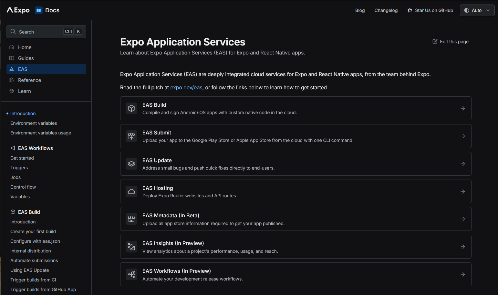

# Welcome to your Expo app 👋

This is an [Expo](https://expo.dev) project created with [`create-expo-app`](https://www.npmjs.com/package/create-expo-app).

## Get started

1. Use the correct Node.js version

   ```bash
   nvm use 22
   ```

2. Install dependencies

   ```bash
   yarn install
   ```

3. Start the app
   ```bash
    npx expo start
   ```

In the output, you'll find options to open the app in a

- [development build](https://docs.expo.dev/develop/development-builds/introduction/)
- [Android emulator](https://docs.expo.dev/workflow/android-studio-emulator/)
- [iOS simulator](https://docs.expo.dev/workflow/ios-simulator/)
- [Expo Go](https://expo.dev/go), a limited sandbox for trying out app development with Expo

You can start developing by editing the files inside the **app** directory. This project uses [file-based routing](https://docs.expo.dev/router/introduction).

## Get a fresh project

When you're ready, run:

```bash
yarn run reset-project
```

This command will move the starter code to the **app-example** directory and create a blank **app** directory where you can start developing.

## Learn more

To learn more about developing your project with Expo, look at the following resources:

- [Expo documentation](https://docs.expo.dev/): Learn fundamentals, or go into advanced topics with our [guides](https://docs.expo.dev/guides).
- [Learn Expo tutorial](https://docs.expo.dev/tutorial/introduction/): Follow a step-by-step tutorial where you'll create a project that runs on Android, iOS, and the web.

## Wireframe

- [FIGMA](https://www.figma.com/design/3uxTPbP34xQLDRJDrzs092/Untitled?node-id=0-1&t=nxTUBrXbq5CT1SxA-1)

## State Management

- [JOTAI](https://jotai.org/docs/guides/react-native)

# Deployment

- Through EAS
  

- [ReadMore](./docs/readme-eas.md)

# Env Config WSL2

- [WSL2 to Win11](https://learn.microsoft.com/en-us/windows/wsl/networking#mirrored-mode-networking)

## expo common cli command

1. Initialize a New Expo Project

npx create-expo-app my-app

    Creates a new Expo project with the default template.

2. Start the Development Server

npx expo start

    Starts the Expo Metro bundler and provides a QR code to scan with the Expo Go app.

3. Run the App on a Specific Platform

npx expo start --android # Run on an Android device/emulator  
npx expo start --ios # Run on an iOS device/simulator (Mac only)  
npx expo start --web # Run in a web browser

4. Install a Package (Expo-Compatible Libraries)

npx expo install package-name

    Installs an Expo-compatible package, ensuring compatibility with the Expo environment.

Example:

npx expo install expo-camera

5. Build an APK/IPA (EAS Build Required)

eas build --platform android # For Android
eas build --platform ios # For iOS (Mac required)

    Requires expo-cli and EAS (Expo Application Services).

6. Publish Updates (OTA - Over-the-Air Updates)

npx expo publish

    Deploys an update to users without requiring an app store release.

7. Prebuild (Convert to Bare Workflow)

npx expo prebuild

    Generates android and ios folders for full native code access (Ejecting from Expo Go).

8. Clear Cache (Fix Issues)

npx expo start --clear

    Clears the Metro bundler cache, useful if you encounter issues.

9. Check Expo SDK Version & Updates

npx expo doctor

    Checks for issues and ensures your dependencies are compatible.

10. Login to Expo Account

npx expo login

    Logs into your Expo account for building and publishing apps.
