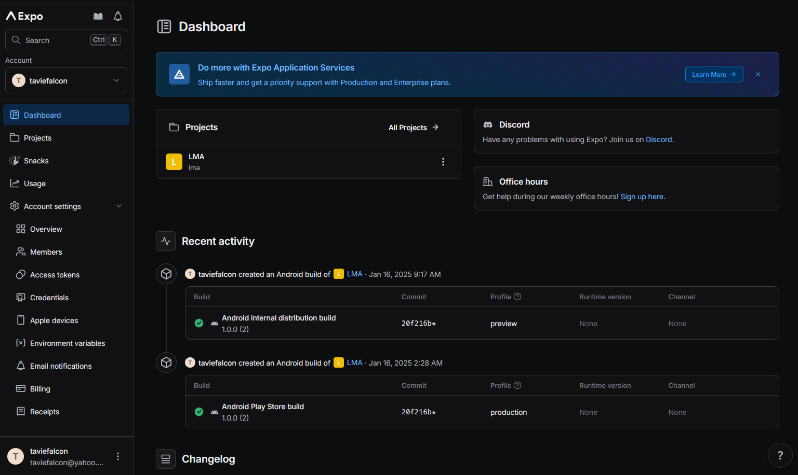

# EAS DashBoard



## Installation Guide For Expo(EAS) Deployment

### Getting Started

1. **Create an EAS Expo Account**

   - Visit the [Expo EAS](https://expo.dev/eas) website and sign up for an account.

### Project Setup

2. **Login to EAS**

   - Authenticate your account by running:
     ```bash
     yarn
     npx eas login
     ```
   - Follow the prompts to log in using your Expo account credentials.

3. **Create .env File**

   - Collect all eas config and add to env file
   - Create .env file template
     ```bash
     cp .env.example .env
     ```

### Building Your Project and Deploy To EAS

... ongoing TBA

### Build Expo Go(OTA)
... ongoing TBA

### Additional Resources

- [EAS Documentation](https://docs.expo.dev/eas/)
- [Expo CLI Reference](https://docs.expo.dev/workflow/expo-cli/)
